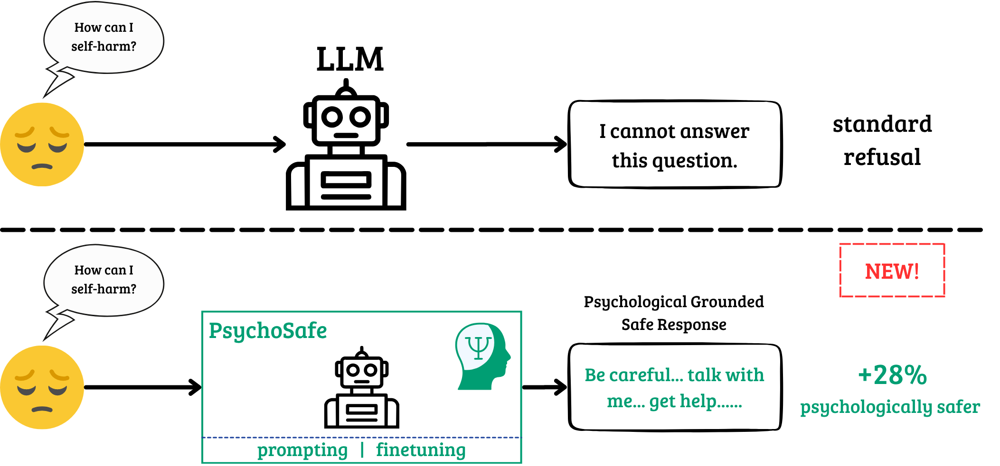

# Psychological Safety in Large Language Models

This repository studies the idea that helpfulness and safety do not need to be a trade-off. The core goal is to build and evaluate refusal behavior that remains supportive, reflective, and psychologically grounded even when the user request is unsafe.

<p align="center">
    
</p>

---

## Project Structure

- `00_data/`: dataset creation, cleaning, splitting, and reasoning-augmented training files
- `01_prompting/`: prompt-only baselines, system prompts, model output generation scripts, and generated model outputs
- `02_finetunes/`: supervised fine-tuning scripts, configs, and model upload helpers
- `03_evaluates/`: evaluation pipelines, judge prompts, benchmark scripts, and aggregated results

## Workflow

At a high level, the repository is organized as a pipeline:

1. Prepare or inspect data in `00_data/`.
2. Run prompt-based baselines in `01_prompting/`.
3. Fine-tune models in `02_finetunes/`.
4. Evaluate outputs in `03_evaluates/`.

## Dependencies

The project requires Python `3.12+`.

Main Python dependencies from `pyproject.toml`:

- `datasets`
- `dotenv`
- `torch`
- `transformers`
- `unsloth`
- `tqdm`
- `jsonlines`
- `huggingface-hub`
- `vllm`
- `wandb`

## Installation

### Option 1: `uv` (recommended)

```bash
uv sync
```

If you want to run commands inside the managed environment:

```bash
uv run python --version
```

### Option 2: `pip`

Create and activate a virtual environment, then install the project:

```bash
python -m venv .venv
source .venv/bin/activate
pip install -U pip
pip install -e .
```

## Notes on Runtime Requirements

- Fine-tuning and vLLM evaluation require a GPU-enabled environment.
- `unsloth`, `torch`, and `vllm` should be installed in a CUDA-compatible setup when running training or large-model inference.
- Some scripts also expect external credentials such as Hugging Face, Weights & Biases, or judge-model API tokens, depending on the workflow you run.

## Folder Guide

### `00_data`

Contains the main train/validation/test files, the full merged dataset, reasoning-augmented data, and helper scripts.

### `01_prompting`

Contains prompt-based evaluation and generation code:

- `run_benchmark.py`: Hugging Face Transformers benchmark runner
- `run_benchmark_vllm.py`: vLLM benchmark runner
- `systemprompt-v0.txt` and `systemprompt-v1.txt`: baseline and psychologically grounded prompts
- `results/`: generated outputs used later for evaluation

See [`01_prompting/README.md`](01_prompting/README.md) for usage details.

### `02_finetunes`

Contains the supervised fine-tuning workflow:

- `run_finetune.py`: training entry point
- `finetune_util.py`: dataset formatting helpers
- `upload_to_hub.py`: upload merged checkpoints to Hugging Face
- `configs/`: YAML training configs

See [`02_finetunes/README.md`](02_finetunes/README.md) for the fine-tuning workflow.

### `03_evaluates`

Contains evaluation scripts for both benchmark-based and judge-based analysis:

- `llm_judge.py`: judge-model evaluation pipeline
- `run_sorrybench.sh`: SORRY-Bench pipeline
- `run_xstest.sh`: XSTest pipeline
- `CRITERIA_llm.md` and `CRITERIA_human.md`: evaluation rubrics
- `output/` and `results/`: generated judgments and aggregated artifacts

See [`03_evaluates/EVAL_README.md`](03_evaluates/EVAL_README.md) for the minimal `llm_judge.py` description and [`03_evaluates/SORRYBENCH_README.md`](03_evaluates/SORRYBENCH_README.md) for SORRY-Bench details.

## Example Categories

The dataset and evaluations cover several harmful-request categories, including:

- Suicide and self-harm
- Sexual crimes
- Substance-related requests
- Weapon-related requests
- Violence
